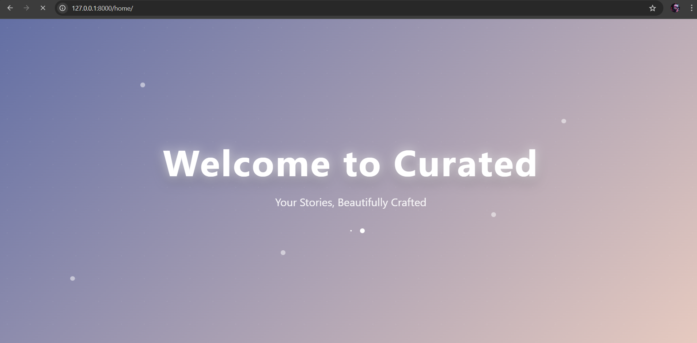
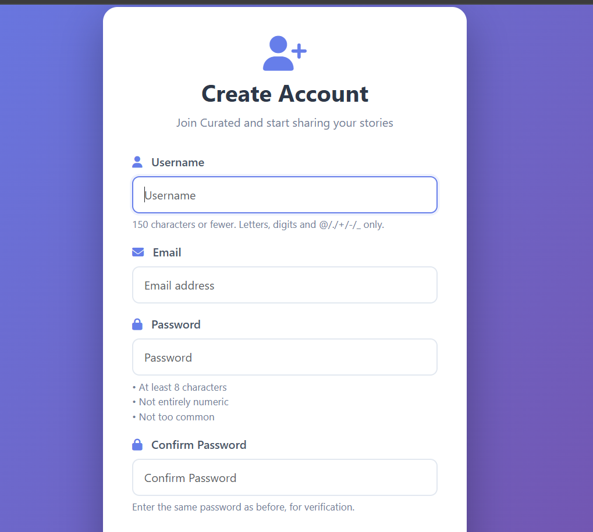
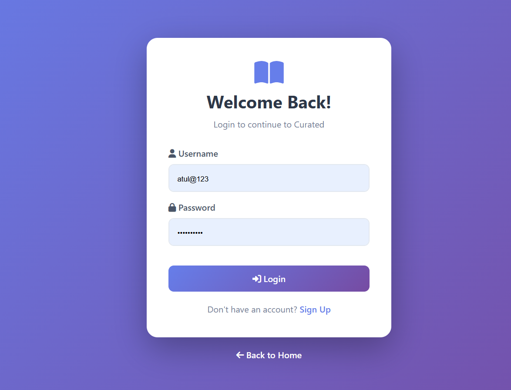
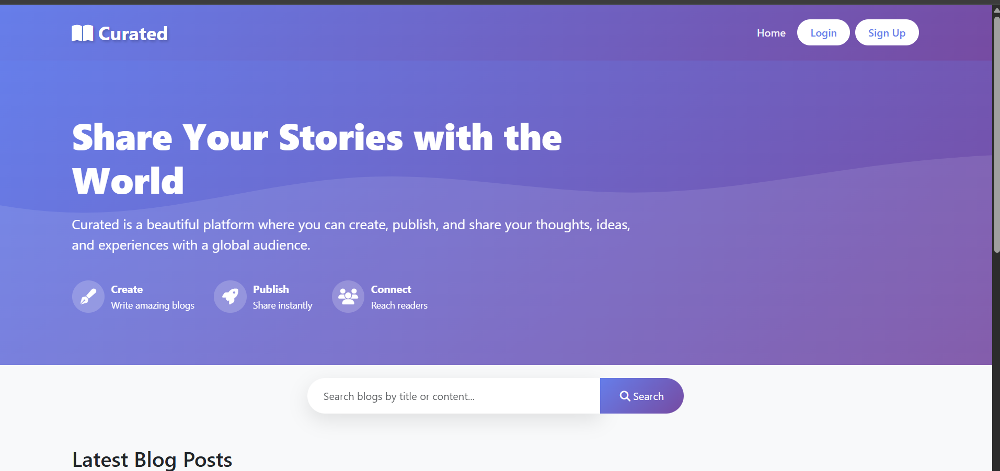
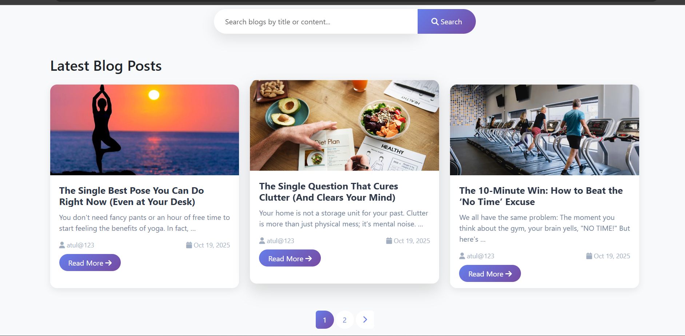
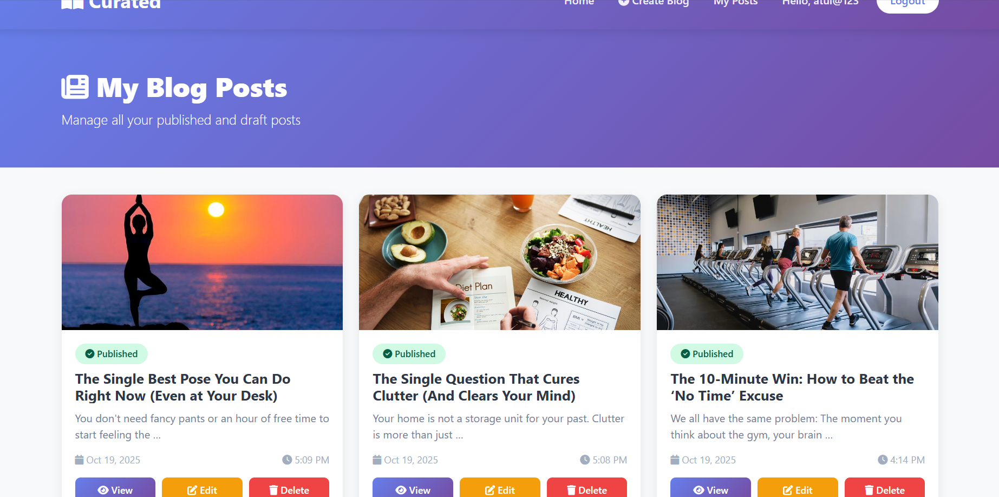
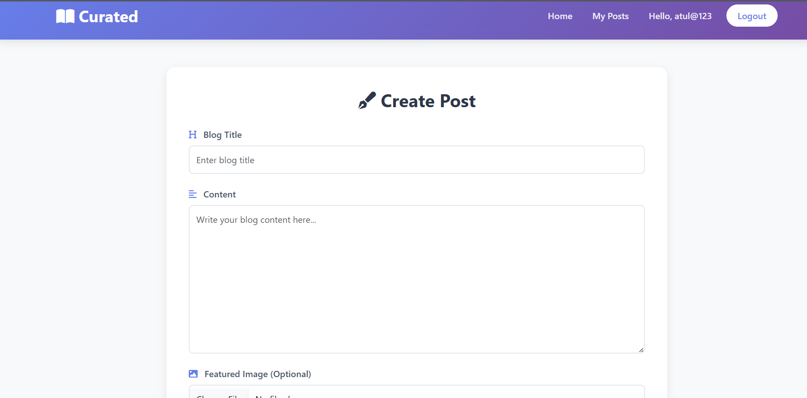
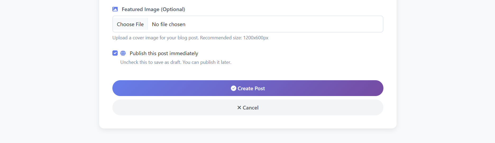

#  Curated - Blog Application

A modern blog platform built with Django for creating and sharing stories.

##  Features
- User Authentication (Signup/Login/Logout)
- Create, Edit, Delete Blog Posts
- Image Upload Support
- Search & Pagination
- Responsive Design
- User Dashboard

##  Tech Stack
- Django 4.x
- Bootstrap 5
- SQLite
- Pillow

##  Installation

1. Clone the repository:
```bash
git clone https://github.com/yourusername/curated-blog.git
cd curated-blog
```

2. Create virtual environment:
```bash
python -m venv venv
source venv/bin/activate  # On Windows: venv\Scripts\activate
```

3. Install dependencies:
```bash
pip install django pillow
```

4. Run migrations:
```bash
python manage.py makemigrations
python manage.py migrate
```

5. Create superuser:
```bash
python manage.py createsuperuser
```

6. Run server:
```bash
python manage.py runserver
```

7. Open browser: `http://127.0.0.1:8000/`











